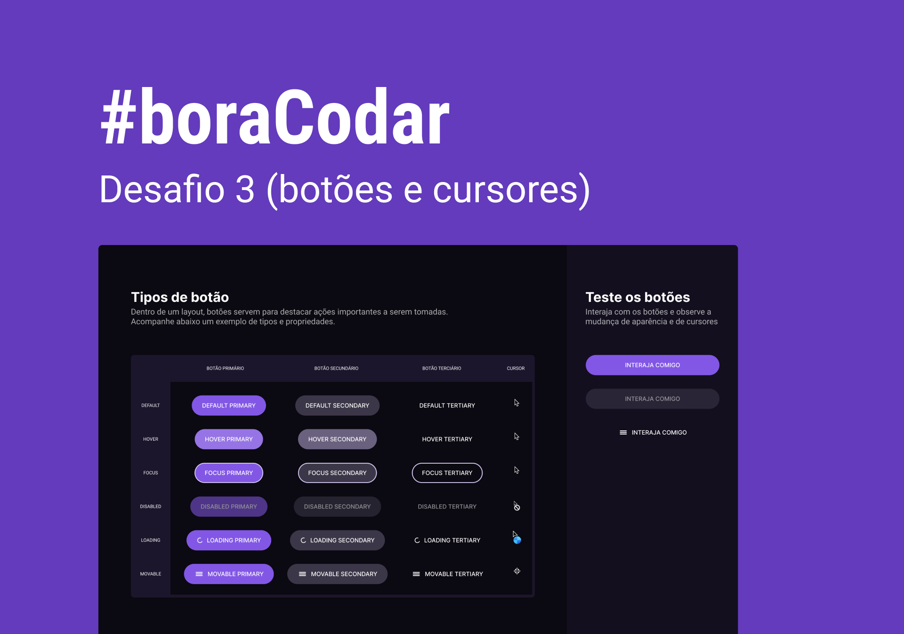

<h1><strong>Buttons and Cursors</strong></h1>

Third Challenge was to create a Button Documentation Screen that has a preview area. Button states and appropriate cursors are displayed as you choose. I made it using Vite + React + Tailwind!

 

